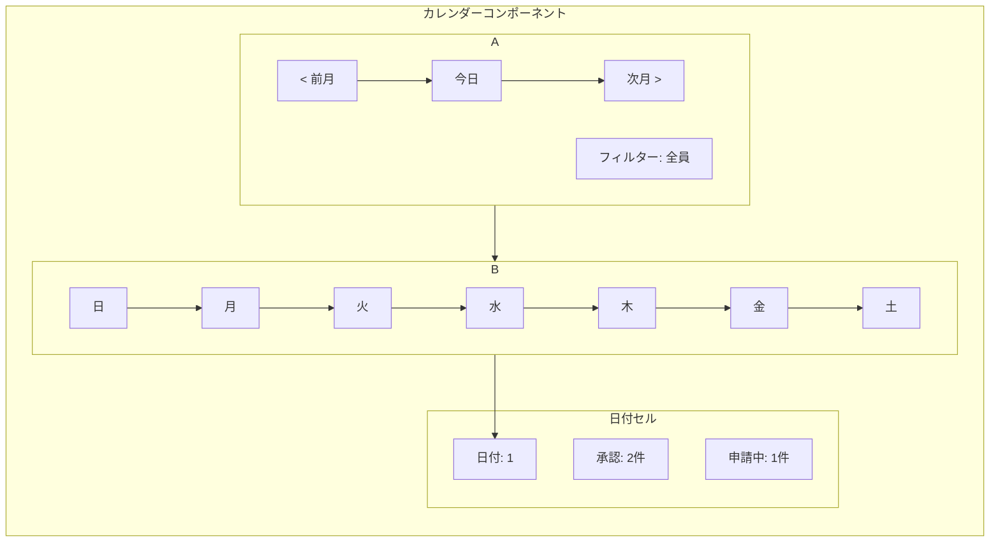

# ダッシュボードカレンダー実装計画書

## 1. 目的

本計画の目的は、ダッシュボードにカレンダー機能を実装し、ユーザーが自身の申請状況やチーム全体の動向を視覚的かつ直感的に把握できるようにすることです。
この機能は、以下の利用者とそれぞれのニーズに応えることを目標とします。

*   **従業員**: 自身の申請履歴と現在のステータス（承認、申請中、却下）をカレンダー上で一覧し、申請管理を容易にする。
*   **管理者**: チームや部署全体の申請状況を俯瞰的に把握し、リソース管理や業務調整の判断材料とする。
*   **承認者**: 自身が承認すべき申請をカレンダー上で確認し、承認プロセスの迅速化を図る。

## 2. 使用技術

### フロントエンド

*   **ライブラリ**: `react-day-picker`
*   **選定理由**:
    *   既にプロジェクトで `shadcn/ui` の一部として導入されており、既存のUIコンポーネントとの親和性が高い。
    *   日付セルのレンダリングをカスタマイズすることで、申請ステータスの表示など、本件の要件を十分に満たすことが可能。
    *   新規ライブラリの導入に伴う学習コストやバンドルサイズの増加を抑制できる。

### バックエンド

*   **フレームワーク**: `Ruby on Rails`
*   **連携方法**:
    *   カレンダー表示に必要な申請データを集計して提供する新しいAPIエンドポイントを作成し、フロントエンドと連携します。

## 3. API設計

### エンドポイント仕様

*   **エンドポイント**: `GET /api/v1/applications/calendar`
*   **説明**: 指定された年月の申請データをカレンダー表示用に集計して返します。ユーザーの権限に応じて返却されるデータ範囲が異なります。
*   **HTTPメソッド**: `GET`
*   **認証**: 必要

#### リクエストパラメータ

| パラメータ | 型 | 必須 | 説明 |
| :--- | :--- | :--- | :--- |
| `year` | Integer | はい | 表示対象の年 (例: `2023`) |
| `month` | Integer | はい | 表示対象の月 (例: `12`) |
| `user_id` | Integer | いいえ | **管理者のみ利用可能。** 特定のユーザーの申請データに絞り込む場合に指定します。 |
| `group_id` | Integer | いいえ | **管理者・承認者のみ利用可能。** 特定のグループ（部署など）の申請データに絞り込む場合に指定します。 |

#### レスポンス形式 (JSON)

日付 (`YYYY-MM-DD`) をキーとし、その日の申請ステータスごとの件数と、申請情報の配列を持つオブジェクトを返します。

```json
{
  "2023-12-01": {
    "pending": 1,
    "approved": 2,
    "rejected": 0,
    "total": 3,
    "applications": [
      { "id": 101, "user_name": "山田 太郎", "status": "申請中" },
      { "id": 102, "user_name": "鈴木 花子", "status": "承認" },
      { "id": 103, "user_name": "佐藤 次郎", "status": "承認" }
    ]
  },
  "2023-12-04": {
    "pending": 0,
    "approved": 1,
    "rejected": 0,
    "total": 1,
    "applications": [
      { "id": 104, "user_name": "山田 太郎", "status": "承認" }
    ]
  }
}
```

## 4. UI/UX設計

### 基本レイアウト

ダッシュボードのメインエリアに月表示のカレンダーを配置します。ヘッダーには年月表示、月移動ボタン、フィルター機能を設けます。



### 日付クリック時の挙動

日付セルをクリックすると、その日の申請詳細リストをモーダルウィンドウで表示します。モーダル内の各項目から申請詳細ページへ遷移可能です。

### 申請ステータスの視覚的表現

各日付セル内に、ステータスごとの件数を色分けされたバッジで表示します。

*   **承認 (Approved)**: 緑色
*   **申請中 (Pending)**: 黄色
*   **却下 (Rejected)**: 赤色

## 5. 実装ステップ

### バックエンド (Ruby on Rails)

1.  **ルーティング**: `config/routes.rb` に `/api/v1/applications/calendar` を追加。
2.  **コントローラー**: `applications_controller.rb` に `calendar` アクションを実装。権限に応じたデータ取得とJSONレスポンスの生成を行う。
3.  **テスト**: `calendar` アクションのリクエストテストを作成。

### フロントエンド (Next.js)

1.  **APIクライアント**: `app/lib/api.ts` にカレンダーデータ取得用の関数を追加。
2.  **カレンダーコンポーネント**: `app/components/DashboardCalendar.tsx` を新規作成。API連携、`react-day-picker` のカスタマイズ、状態管理を実装。
3.  **モーダルコンポーネント**: `app/components/ApplicationDetailModal.tsx` を新規作成し、日付クリック時の詳細表示を実装。
4.  **統合**: 作成したカレンダーコンポーネントをダッシュボードページに配置。