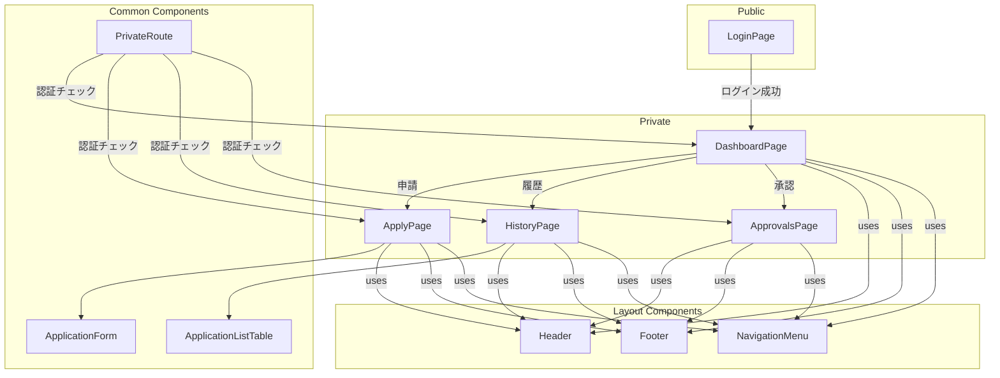

# 在宅勤務申請システム 開発ガイド

## 1. はじめに

このドキュメントは、在宅勤務申請システムの開発を引き継ぐメンバーのために、現状の実装内容、今後の課題、修正すべき点をまとめたものです。

## 2. 画面構成図

現在のフロントエンドの主要なページとコンポーネントの関係は以下の通りです。

- **LoginPage**: ログイン画面。認証が完了するとダッシュボードへ遷移します。
- **PrivateRoute**: 認証が必要なページをラップし、未認証ユーザーのアクセスを制御します。
- **DashboardPage**: ログイン後のトップページ。各機能への起点となります。
- **ApplyPage**: 新規の在宅勤務を申請するページです。
- **HistoryPage**: 自身の申請履歴を一覧で確認できるページです。
- **ApprovalsPage**: マネージャー向けのページで、部下からの申請を承認・却下できます。

## 3. API 仕様

### 3.1. 実装済み API

| 目的               | URL                                   | HTTP メソッド | 主要なリクエストパラメータ      | 備考                                |
| :----------------- | :------------------------------------ | :------------ | :------------------------------ | :---------------------------------- |
| **認証**           |                                       |               |                                 |                                     |
| ログイン           | `/api/v1/auth/sign_in`                | `POST`        | `email`, `password`             |                                     |
| **申請**           |                                       |               |                                 |                                     |
| 申請履歴の取得     | `/api/v1/applications`                | `GET`         | (なし)                          |                                     |
| 新規申請           | `/api/v1/applications`                | `POST`        | `application: { date, reason }` | `application_type` の考慮が未実装   |
| **承認**           |                                       |               |                                 |                                     |
| 承認待ち一覧の取得 | `/api/v1/approvals`                   | `GET`         | (なし)                          |                                     |
| 申請の承認/却下    | `/api/v1/approvals/:id`               | `PATCH`       | `status`, `comment`             | `rejection_reason` の必須化が未実装 |
| **管理者機能**     |                                       |               |                                 |                                     |
| 人事異動の予約一覧 | `/api/v1/admin/user_info_changes`     | `GET`         | (なし)                          |                                     |
| 人事異動の予約取消 | `/api/v1/admin/user_info_changes/:id` | `DELETE`      | (なし)                          |                                     |
| 外部連携設定の取得 | `/api/v1/admin/tenant_settings`       | `GET`         | (なし)                          |                                     |

### 3.2. 実装が必要な API

| 目的               | URL                                        | HTTP メソッド | 主要なリクエストパラメータ          | レスポンス例                                                       |
| :----------------- | :----------------------------------------- | :------------ | :---------------------------------- | :----------------------------------------------------------------- |
| **ユーザー**       |                                            |               |                                     |                                                                    |
| 申請上限回数の取得 | `/api/v1/users/:user_id/application_limit` | `GET`         | (なし)                              | `{"limit_count": 10, "reason": "..."}`                             |
| プロファイル取得   | `/api/v1/users/:user_id/profile`           | `GET`         | (なし)                              | `{"outlook_setting": {...}}`                                       |
| プロファイル更新   | `/api/v1/users/:user_id/profile`           | `PUT`         | `outlook_setting`, `commute_routes` | `{"message": "Profile updated."}`                                  |
| **管理者機能**     |                                            |               |                                     |                                                                    |
| 人事異動の予約作成 | `/api/v1/admin/user_info_changes`          | `POST`        | `user_id`, `effective_date`, ...    | `{"id": 1, ...}`                                                   |
| 人事異動の予約更新 | `/api/v1/admin/user_info_changes/:id`      | `PUT`         | `effective_date`, ...               | `{"id": 1, ...}`                                                   |
| 外部連携設定の更新 | `/api/v1/admin/tenant_settings/:id`        | `PUT`         | `settings`                          | `{"id": 1, ...}`                                                   |
| 新規ユーザー登録   | `/api/v1/admin/users`                      | `POST`        | `name`, `email`, `department_id`, `role_id` | **Success (201 Created):** `{ "id": 1, "name": "...", ... }`   **Error (422 Unprocessable Entity):** `{ "errors": { "email": ["has already been taken"] } }` |
| ユーザー削除       | `/api/v1/admin/users/:id`                  | `DELETE`      | (なし)                              | **Success (204 No Content):** (no body)   **Error (404 Not Found):** `{ "error": "User not found" }` |
| **通知**           |                                            |               |                                     |                                                                    |
| 通知一覧の取得     | `/api/v1/notifications`                    | `GET`         | (なし)                              | `[{"id": 1, "message": "...", "read": false, "link": "/history"}]` |
| 通知を既読にする   | `/api/v1/notifications/:id/read`           | `PATCH`       | (なし)                              | `{"message": "Notification marked as read."}`                      |

## 4. データベース設計

### 4.1. テーブル変更・追加

#### `users` テーブル

| カラム名             | 型      | オプション     | 目的             |
| -------------------- | ------- | -------------- | ---------------- |
| `is_child_caregiver` | boolean | default: false | 育児対象者の有無 |
| `is_caregiver`       | boolean | default: false | 介護対象者の有無 |

#### `applications` テーブル

| カラム名           | 型     | オプション | 目的                                                                                |
| ------------------ | ------ | ---------- | ----------------------------------------------------------------------------------- |
| `application_type` | string |            | 申請種別 (`normal`, `special_approval`, `over_8_hours`, `late_night_early_morning`) |

#### `approvals` テーブル

| カラム名           | 型     | オプション | 目的                                         |
| ------------------ | ------ | ---------- | -------------------------------------------- |
| `status`           | string |            | 承認ステータス (`approved`, `rejected`)      |
| `rejection_reason` | text   |            | 却下理由（`status`が`rejected`の場合に必須） |

#### `user_info_changes` テーブル (新規作成)

| カラム名            | 型     | 目的                                      |
| ------------------- | ------ | ----------------------------------------- |
| `user_id`           | bigint | 対象ユーザー                              |
| `changer_id`        | bigint | 変更者（管理者）                          |
| `effective_date`    | date   | 変更反映日                                |
| `new_department_id` | bigint | 新しい部署                                |
| `new_role_id`       | bigint | 新しい役職                                |
| `new_manager_id`    | bigint | 新しい上長                                |
| `status`            | string | 状態 (`pending`, `processed`, `canceled`) |

#### `user_profiles` テーブル (新規作成)

| カラム名          | 型     | 目的             |
| ----------------- | ------ | ---------------- |
| `user_id`         | bigint | ユーザー         |
| `outlook_setting` | json   | Outlook 連携設定 |
| `commute_routes`  | json   | 通勤経路情報     |

#### `tenant_settings` テーブル (新規作成)

| カラム名   | 型     | 目的               |
| ---------- | ------ | ------------------ |
| `name`     | string | 設定名             |
| `settings` | json   | 設定内容（暗-      |
| `settings` | json   | 設定内容（暗号化） |

#### `notifications` テーブル (新規作成)

| カラム名          | 型      | 目的                                             |
| ----------------- | ------- | ------------------------------------------------ |
| `id`              | bigint  | 主キー                                           |
| `user_id`         | bigint  | 通知を受け取るユーザー                           |
| `notifiable_type` | string  | 通知元のモデル名 (例: `Application`, `Approval`) |
| `notifiable_id`   | bigint  | 通知元のレコード ID                              |
| `message`         | text    | 通知メッセージ                                   |
| `link`            | string  | 通知クリック時の遷移先パス                       |
| `read`            | boolean | 既読フラグ (default: `false`)                    |

## 5. 実装概要

### 5.1. 主要ライブラリと役割

#### バックエンド (Ruby on Rails)

- **devise_token_auth**: トークンベースの認証機能を提供します。
- **Pundit**: 認可（権限管理）機能を提供します。コントローラーやビューでユーザーの操作権限を制御します。
- **rack-cors**: フロントエンドからの API リクエストを許可するための CORS 設定を行います。
- **microsoft_graph**: Microsoft Graph API と連携し、Outlook カレンダーへのアクセスなどに使用します。

#### フロントエンド (Next.js)

- **axios**: HTTP クライアントとして、バックエンド API との通信に使用します。
- **@mui/material**: UI コンポーネントライブラリ。統一感のある UI を効率的に構築します。
- **Zustand**: シンプルな状態管理ライブラリ。認証情報などのグローバルな状態を管理します。
- **Next.js**: React フレームワーク。ルーティング、サーバーサイドレンダリングなどを担当します。

### 5.2. 通知機能の実装方針

- **トリガー**: `Application` モデルや `Approval` モデルのステータスが変更された際に、`after_commit` コールバックなどを利用して通知生成ジョブをキューに追加します。
- **非同期処理**: `Sidekiq` や `Active Job` を用いて、通知の生成と送信を非同期で行い、リクエストのレスポンスタイムへの影響を避けます。
- **通知内容**: 通知メッセージには、申請日や申請者、ステータスなど、ユーザーが状況を把握できる十分な情報を含めます。`link` には関連するページの URL（例: `/history`, `/approvals`）を設定します。

### 5.3. 人事異動のバッチ処理

- **スケジューリング**: `whenever` などの gem を利用して、毎日深夜などにバッチ処理を実行する cron ジョブをセットアップします。
- **処理内容**: バッチ処理は、`user_info_changes` テーブルから `effective_date` が当日付かつ `status` が `pending` のレコードを検索します。対象レコードが見つかった場合、`users` テーブルの関連情報を更新し、`status` を `processed` に変更します。
- **冪等性**: バッチ処理は複数回実行されても問題が発生しないよう、冪等性を担保した設計にする必要があります（例: 一度 `processed` になったレコードは再処理しない）。

### 5.4. 開発フロー

1.  **バックエンド**: `bundle install` で依存関係をインストールします。
2.  **フロントエンド**: `npm install` で依存関係をインストールします。
3.  `docker-compose up` でデータベースとバックエンドサーバーを起動します。
4.  `frontend` ディレクトリで `npm run dev` を実行し、開発サーバーを起動します。

## 6. 今後の課題と修正すべき点

### 6.1. バックエンド実装タスクリスト

フロントエンドの実装状況に基づき、バックエンドで優先的に実装が必要な機能は以下の通りです。

- **通知機能の実装**:
  - 申請・承認・却下などのイベントをトリガーに通知を生成する。
  - ユーザーが未読の通知を取得するための API エンドポイント (`GET /api/v1/notifications`) を作成する。
  - 通知を既読にするための API エンドポイント (`PATCH /api/v1/notifications/:id/read`) を作成する。
- **人事異動の予約機能（拡充）**:
  - 新規予約作成 (`POST /api/v1/admin/user_info_changes`) の実装。
  - 予約編集 (`PUT /api/v1/admin/user_info_changes/:id`) の実装。
  - 予約された変更を `effective_date` に基づいて自動的に適用するバッチ処理の実装。
- **動的な申請上限回数の計算ロジック**:
  - `GET /api/v1/users/:user_id/application_limit` で、ユーザーの勤続年数や育児・介護情報に基づいた上限回数を計算して返すロジックを実装する。
- **申請・承認機能の強化**:
  - 申請 API (`POST /api/v1/applications`) で `application_type` を受け取り、適切に保存・処理する。
  - 承認 API (`PATCH /api/v1/approvals/:id`) で却下時に `rejection_reason` を必須とするバリデーションを追加する。
- **ユーザープロファイル機能**:
  - Outlook 連携設定、通勤経路情報を保存・更新するためのロジック (`PUT /api/v1/users/:user_id/profile`) を実装する。
- **外部連携設定**:
  - テナント管理者が外部サービスの API キーなどを安全に保存・更新できるロジック (`PUT /api/v1/admin/tenant_settings/:id`) を実装する。

### 6.2. フロントエンド実装タスク

*   **申請フォームのAPI連携**:
    *   `ApplicationForm.tsx` の `handleSubmit` 関数に、`POST /api/v1/applications` を呼び出すAPI通信処理を実装する。
    *   フォームの入力内容（勤務形態、特認申請、8時間以上勤務など）をAPIのリクエストパラメータ（特に `application_type`）にマッピングするロジックを実装する。
*   **通知機能のAPI連携**:
    *   `NotificationBell.tsx` で、ダミーデータを使用している箇所を `GET /api/v1/notifications` APIの呼び出しに置き換える。
    *   通知クリック時に `PATCH /api/v1/notifications/:id/read` APIを呼び出し、通知を既読にする処理を実装する。

### 6.3. リファクタリング候補

- **エラーハンドリングの強化**: API 通信エラーやバリデーションエラーのハンドリングを改善し、ユーザーに分かりやすいフィードバックを提供する必要があります。
- **コンポーネントの分割**: `ApplicationListTable` や承認ページのテーブルなど、再利用可能、または肥大化したコンポーネントをより小さな単位に分割し、可読性とメンテナンス性を向上させます。
- **Pundit の活用徹底**: `ApplicationsController` にも Pundit による認可ロジックを追加し、権限管理の仕組みを統一します。

## 7. 動作確認用テストユーザー

開発環境で動作確認を行うためのテストユーザー情報です。

| 役割   | メールアドレス        | パスワード |
| :----- | :-------------------- | :--------- |
| 管理者 | admin@example.com     | password   |
| 承認者 | approver@example.com  | password   |
| 申請者 | applicant@example.com | password   |
