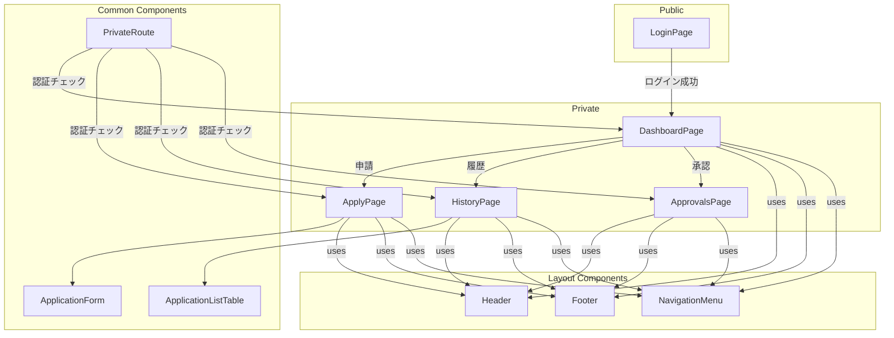

# 在宅勤務申請システム 開発ガイド

## 1. はじめに

このドキュメントは、在宅勤務申請システムの開発を引き継ぐメンバーのために、現状の実装内容、今後の課題、修正すべき点をまとめたものです。

## 2. 画面構成図

現在のフロントエンドの主要なページとコンポーネントの関係は以下の通りです。

*   **LoginPage**: ログイン画面。認証が完了するとダッシュボードへ遷移します。
*   **PrivateRoute**: 認証が必要なページをラップし、未認証ユーザーのアクセスを制御します。
*   **DashboardPage**: ログイン後のトップページ。各機能への起点となります。
*   **ApplyPage**: 新規の在宅勤務を申請するページです。
*   **HistoryPage**: 自身の申請履歴を一覧で確認できるページです。
*   **ApprovalsPage**: マネージャー向けのページで、部下からの申請を承認・却下できます。

## 3. API仕様書

実装済みの主要なAPIエンドポイントです。

| 目的 | URL | HTTPメソッド | 主要なリクエストパラメータ | レスポンス例 |
| :--- | :--- | :--- | :--- | :--- |
| **認証** | | | | |
| ログイン | `/api/v1/auth/sign_in` | `POST` | `email`, `password` | `{"data": {"id": 1, "email": "...", ...}}` |
| **申請** | | | | |
| 申請履歴の取得 | `/api/v1/applications` | `GET` | (なし) | `[{"id": 1, "start_date": "...", ...}]` |
| 新規申請 | `/api/v1/applications` | `POST` | `application: { date, reason }` | `{"id": 1, "start_date": "...", ...}` |
| **承認** | | | | |
| 承認待ち一覧の取得 | `/api/v1/approvals` | `GET` | (なし) | `[{"id": 2, "user": {...}, ...}]` |
| 申請の承認/却下 | `/api/v1/approvals/:id` | `PATCH` | `status: "approved" or "rejected"`, `comment` | `{"message": "Application approved successfully."}` |

## 4. 実装概要

### 4.1. 主要ライブラリと役割

#### バックエンド (Ruby on Rails)

*   **devise_token_auth**: トークンベースの認証機能を提供します。
*   **Pundit**: 認可（権限管理）機能を提供します。コントローラーやビューでユーザーの操作権限を制御します。
*   **rack-cors**: フロントエンドからのAPIリクエストを許可するためのCORS設定を行います。
*   **microsoft_graph**: Microsoft Graph APIと連携し、Outlookカレンダーへのアクセスなどに使用します。

#### フロントエンド (Next.js)

*   **axios**: HTTPクライアントとして、バックエンドAPIとの通信に使用します。
*   **@mui/material**: UIコンポーネントライブラリ。統一感のあるUIを効率的に構築します。
*   **Zustand**: シンプルな状態管理ライブラリ。認証情報などのグローバルな状態を管理します。
*   **Next.js**: Reactフレームワーク。ルーティング、サーバーサイドレンダリングなどを担当します。

### 4.2. 開発フロー

1.  **バックエンド**: `bundle install` で依存関係をインストールします。
2.  **フロントエンド**: `npm install` で依存関係をインストールします。
3.  `docker-compose up` でデータベースとバックエンドサーバーを起動します。
4.  `frontend` ディレクトリで `npm run dev` を実行し、開発サーバーを起動します。

## 5. 今後の課題と修正すべき点

### 5.1. 未実装のロジック

要求仕様書にある以下の複雑な申請ルールは未実装です。

*   **申請回数制限**: 週2回までといった申請回数の上限チェックロジック。
*   **特認承認の条件**: 特定の条件下（役職など）で必要となる特別な承認フロー。
*   **部分在宅勤務のカウント**: 半日単位などの部分的な在宅勤務の申請と、回数カウントのロジック。
*   **申請の編集・削除機能**: ユーザーが一度提出した申請を修正したり、取り下げたりする機能。

### 5.2. リファクタリング候補

*   **エラーハンドリングの強化**: API通信エラーやバリデーションエラーのハンドリングを改善し、ユーザーに分かりやすいフィードバックを提供する必要があります。
*   **コンポーネントの分割**: `ApplicationListTable` や承認ページのテーブルなど、再利用可能、または肥大化したコンポーネントをより小さな単位に分割し、可読性とメンテナンス性を向上させます。
*   **Punditの活用徹底**: `ApplicationsController` にもPunditによる認可ロジックを追加し、権限管理の仕組みを統一します。

### 5.3. 外部連携の詳細化

*   **Outlook連携**: 現在は認証のコールバック処理の雛形が存在するのみです。OAuth2.0の認証フローを完成させ、承認済みの申請をOutlookカレンダーに自動で登録する機能を実装する必要があります。
*   **路線情報連携**: 交通費計算のための路線情報連携機能は構想段階です。外部API（駅すぱあと等を想定）の選定と、APIを呼び出して交通費を算出するロジックの実装が必要です。

## 6. 動作確認用テストユーザー

開発環境で動作確認を行うためのテストユーザー情報です。

| 役割 | メールアドレス | パスワード |
| :--- | :--- | :--- |
| 管理者 | admin@example.com | password |
| 承認者 | approver@example.com | password |
| 申請者 | applicant@example.com | password |